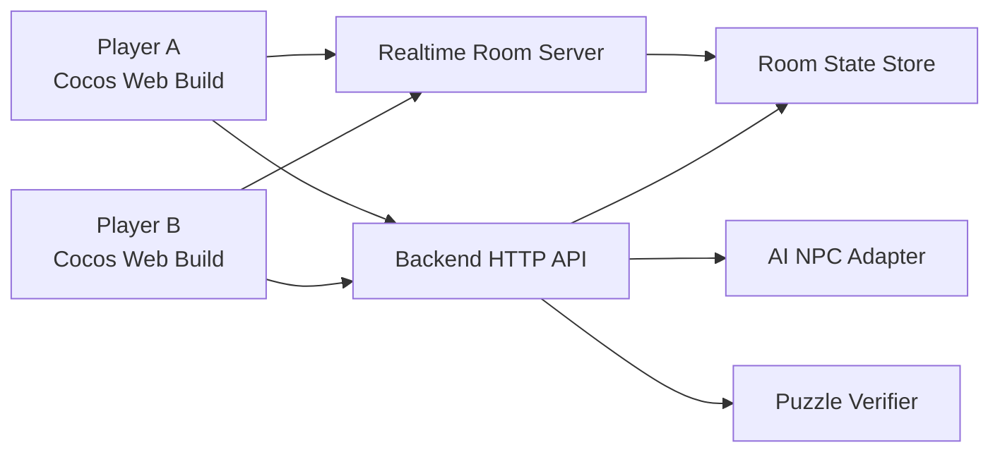

# Architecture Design: Escape NTHU

## Architecture Goals

- Keep Cocos Creator as the required game frontend.
- Keep API keys and AI prompts on the backend.
- Make the MVP playable even if AI or networking fails during demo.
- Separate core gameplay from UI and network transport to reduce merge conflicts.
- Make technical effort visible: real-time sync, AI prompt control, puzzle verification, and game-state management.

## Recommended Tech Stack

| Layer | Choice | Reason |
| --- | --- | --- |
| Game frontend | Cocos Creator 2.4.8, TypeScript | Required by course; TypeScript helps team collaboration. |
| Backend | Node.js + TypeScript | Same language family as Cocos scripts; easy WebSocket/API integration. |
| HTTP API | Fastify or Express | Lightweight route handling for AI and puzzle verification. |
| Realtime | WebSocket (`ws` or Socket.IO) | Room state sync for two players. |
| Persistence | In-memory store for MVP, optional JSON/SQLite later | Fastest path for demo; no account system needed. |
| AI provider | Backend-side LLM adapter | Keeps keys private and allows fallback scripted hints. |

## Runtime Overview



## Frontend Structure

Cocos project layout (Cocos Creator 2.4.8, scene files use `.fire`):

```text
assets/
  scenes/
    Boot.fire
    Lobby.fire
    Game.fire
    Result.fire
  scripts/
    core/
      GameManager.ts
      GameState.ts
      EventBus.ts
      Config.ts
    player/
      PlayerController.ts
      PlayerAnimator.ts
      CameraFollow.ts
      RemotePlayer.ts
    map/
      RoomRegistry.ts
      RoomManager.ts
      RoomController.ts
      DoorTrigger.ts
      Interactable.ts
      ClueObject.ts
      SafeZone.ts
    ghost/
      GhostController.ts
      PatrolPath.ts
      DetectionZone.ts
    dialogue/
      DialoguePanel.ts
      DialogueClient.ts
      NpcProfile.ts
    puzzle/
      PuzzlePanel.ts
      PuzzleClient.ts
      LockState.ts
    coop/
      RoomClient.ts
      SyncModel.ts
    ui/
      NotebookPanel.ts
      Toast.ts
      LoadingOverlay.ts
  maps/
    tilesets/           # Tiled tileset images (.png) and definitions (.tsx)
    delta-hallway-1f.tmx
    delta-hallway-2f.tmx
    delta-lab-301.tmx
    cs-server-room.tmx
  resources/
    prefabs/
      rooms/            # Room prefabs loaded at runtime via cc.resources.load
      player/
  art/
  audio/
```

For details on the Game scene node hierarchy, collision system, and room management, see [frontend-architecture.md](./frontend-architecture.md).

## Cocos Scenes

| Scene | Purpose | Owner |
| --- | --- | --- |
| Boot | Load config, backend URL, preload common assets | 鄭名緯 |
| Lobby | Create/join room, choose Player A/B | 鄭名緯, 陳可冀 |
| Game | Main top-down exploration, ghost, clues, locks | 李久恩 |
| Result | Escape result, AC summary, ending screen | 李久恩, 潘睦婷 |

## Core Frontend Modules

| Module | Responsibility | Notes |
| --- | --- | --- |
| `PlayerController` | Movement, sprint, interaction ray/range | Must feel stable before art polish. |
| `GhostController` | Patrol, detect, chase, catch, reset | Use simple finite-state machine. |
| `RoomClient` | WebSocket connection and room events | Never let gameplay scripts call raw socket directly. |
| `DialogueClient` | Send player question, receive NPC answer | Adds clue context; handles fallback. |
| `PuzzleClient` | Submit lock answer, receive AC/WA | Updates lock/key state through `GameState`. |
| `NotebookPanel` | Collected clues and AI hints | Useful for demo clarity. |
| `EventBus` | Local game events | Reduces scene coupling and merge conflicts. |

## Backend Structure

Suggested backend layout:

```text
server/
  src/
    app.ts
    config.ts
    routes/
      health.ts
      dialogue.ts
      puzzle.ts
      room.ts
    realtime/
      websocket.ts
      room-state.ts
      events.ts
    ai/
      npc-service.ts
      prompt-builder.ts
      fallback-hints.ts
    puzzles/
      puzzle-registry.ts
      verifier.ts
      fixtures/
        lock-01-shortest-path.json
    tests/
      verifier.test.ts
      prompt-builder.test.ts
```

## Backend Responsibilities

| Service | Responsibility |
| --- | --- |
| Room service | Create room code, assign player roles, keep room state. |
| Realtime gateway | Broadcast movement snapshots, clue collection, lock state, and disconnects. |
| AI NPC service | Build bounded prompt, enforce hint tiers, call AI provider or fallback hints. |
| Puzzle verifier | Deterministically check answer against predefined puzzle data. |
| Health route | Provide simple backend readiness check for development/demo. |

## API Contracts

### Create Room

`POST /api/rooms`

Response:

```json
{
  "roomId": "ABCD",
  "playerId": "p_123",
  "role": "A"
}
```

### Join Room

`POST /api/rooms/:roomId/join`

Request:

```json
{
  "preferredRole": "B"
}
```

Response:

```json
{
  "roomId": "ABCD",
  "playerId": "p_456",
  "role": "B",
  "state": {
    "unlockedLocks": [],
    "collectedClues": []
  }
}
```

### Dialogue

`POST /api/dialogue`

Request:

```json
{
  "roomId": "ABCD",
  "playerId": "p_456",
  "npcId": "ai-ta-01",
  "message": "如果圖沒有負權重，最短路徑要用什麼？",
  "visibleClueIds": ["graph-note-01", "error-log-01"]
}
```

Response:

```json
{
  "npcId": "ai-ta-01",
  "reply": "如果每條邊的權重都不是負數，可以先考慮從起點出發的 Dijkstra。",
  "hintTier": 2,
  "revealedClueIds": ["hint-dijkstra"]
}
```

### Puzzle Submission

`POST /api/puzzles/:lockId/submit`

Request:

```json
{
  "roomId": "ABCD",
  "playerId": "p_123",
  "answer": "5"
}
```

Response:

```json
{
  "status": "AC",
  "lockId": "lock-01",
  "unlockedRewardId": "key-01",
  "attempts": 2
}
```

## WebSocket Events

| Event | Direction | Payload |
| --- | --- | --- |
| `player:move` | client to server | player id, position, direction, animation state |
| `player:snapshot` | server to clients | latest visible state of both players |
| `clue:collected` | both | clue id, collector id, timestamp |
| `lock:updated` | server to clients | lock id, status, reward id |
| `ghost:state` | host/server to clients | ghost id, state, position |
| `room:member-left` | server to clients | player id, reconnect window |

## Game-State Model

```ts
type RoomState = {
  roomId: string;
  players: Record<string, PlayerState>;
  collectedClues: string[];
  unlockedLocks: string[];
  npcHintTiers: Record<string, number>;
  puzzleAttempts: Record<string, number>;
  phase: "lobby" | "playing" | "escaped" | "failed";
};
```

## AI NPC Control Strategy

The AI NPC should behave like a hint source, not an answer machine.

- The backend owns NPC profiles and system prompts.
- Every request includes only discovered clue IDs and summarized clue text.
- Each NPC has hint tiers: vague, directional, near-solution.
- Direct answer requests are refused unless enough clues are discovered.
- Fallback scripted hints exist for demo reliability.

## Puzzle Strategy

MVP puzzle: shortest path lock.

- Player A sees the lock prompt and answer field.
- Player B finds graph notes and can ask the AI NPC about method.
- The answer is a numeric shortest-path result.
- Backend checks exact answer; no arbitrary code execution.

This keeps the programming theme visible while avoiding the security and time cost of building a full online judge.

## Risk And Fallbacks

| Risk | Mitigation | Fallback |
| --- | --- | --- |
| AI gives away answer | Prompt tiers, clue gating, server-side post-check | Scripted hint table |
| Two-player networking unstable | Sync only essential state first | Same-machine two-window demo or role-switch debug mode |
| Ghost chase feels bad | Prototype with simple patrol/chase FSM early | Reduce speed/detection, make it atmospheric instead of punishing |
| Puzzle too hard | Use one short-path puzzle with visible graph | Add notebook hint after failed attempts |
| Cocos merge conflicts | Separate scripts, prefabs, and scenes by ownership | One scene integrator merges at milestones |

